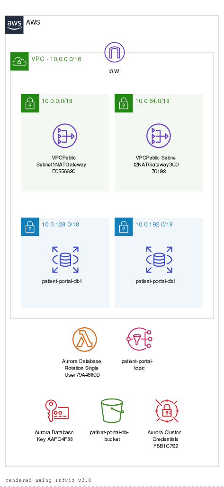
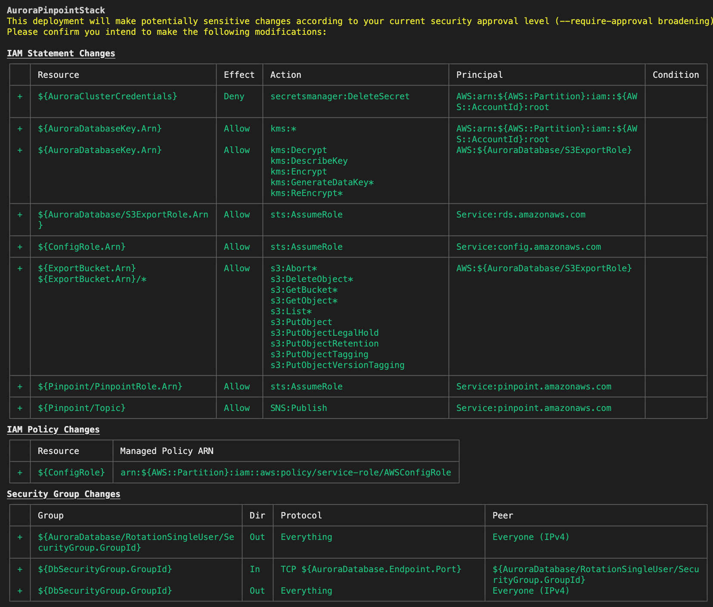

# AWS CDK v2 - NextJS, with Aurora MySQL and Cloudwatch Monitoring -- TypeScript

This project aims to designed to build a compliant application stack that aims to pass SOC 2, GDPR, and HIPAA controls. It leverages AWS Config and CloudWatch for monitoring and alerting and uses AWS services such as Next.js and RDS Aurora MySQL to provide a scalable and secure architecture.

## AuroraPinpointStack



## AuroraPinpointStack/**NextjsAppHosting**


## Getting Started

To get started with this project, follow the steps below:

1. Clone the repository to your local machine.
2. Install the AWS CLI and configure your credentials.
3. Install the AWS CDK CLI.
4. Install the project dependencies by running `npm install` in the project directory.
5. Update the project configuration in `cdk.json` to match your AWS account settings.

The `cdk.json` file tells the CDK Toolkit how to execute your app.

## Building and Deploying the Stack

- `npm run build` compile typescript to js
- `npm run watch` watch for changes and compile
- `npm run test` perform the jest unit tests
- `cdk deploy` deploy this stack to your default AWS account/region
- `cdk diff` compare deployed stack with current state
- `cdk synth` emits the synthesized CloudFormation template

## Project Structure

The project is structured as follows:

- `./cdk.json`: Configuration file for the AWS CDK v2 uses.
- `./lib/`: Contains the TypeScript code for the AWS CDK stack.
- `./lib/aws-serverless-aurora-pinpoint-stack.ts`: CDK construct for creating an Aurora Serverless database cluster.
- `./lib/apps/nextjs-app-hosting.ts`: CDK app for creating a Next.js application stack.
- `./lib/constructs/config-compliance[gdpr,hippa,soc].ts`: CDK construct for enabling AWS Config.
- `./lib/constructs/clouldwatch-dashboard..ts`: CDK construct for enabling CloudWatch monitoring and alerts.

## Compliance Controls

This project is designed to comply with SOC 2, GDPR, and HIPAA controls. The following controls are implemented:

- Data encryption at rest and in transit
- Access controls using IAM roles and policies
- Continuous monitoring using AWS Config and CloudWatch
- Auditing and logging of all application activity
- Automatic backups and disaster recovery using Aurora Serverless
- Secure email communication using Pinpoint (optional)

### Features

- [ ] Sets budgets email alerts
- [ ] SOC 2 Compliance rules
- [ ] HIPAA Compliance rules
- [ ] GDPR Compliance rules
- [ ] Create an appropriate VPC
- [ ] Properly Managed Credentials Management with Secret Manager
- [ ] Key Management including Rotation
- [ ] Database Security Group configuration while allowing access from anywhere
- [ ] Database InstanceType management to prevent over provisioning
- [ ] Aurora Database Cluster creation with good practices
- [ ] Next.js 13 Webapp CI/D triggered by a merge from a pull request to main
- [ ] Next.js receives database connection values as environment variables from Aurora Database Cluster stack
- [ ] Add secure domain name to hosted Next.js
- [ ] Cloudwatch dashboard creation with appropriate alerts

## Manual Steps for Run-books Play-Books

1. **Create an AWS account:** Users will need to manually create a new AWS account before using the CDK.
2. **Manage IAM roles and permissions:** Users will need to manually manage their IAM roles and permissions as necessary, such as adding or removing users from roles or adjusting permissions.
3. **Configure DNS settings:** The CDK can create and manage resources such as EC2 instances, RDS instances, and S3 buckets, but it cannot configure DNS settings.
4. **Set up SSL/TLS certificates:** Users will need to manually obtain and configure SSL/TLS certificates for their resources.
5. **Configure custom domain names:** Users will need to manually configure custom domain names for their resources.
6. **Migrate data:** While the CDK can create and manage databases, it cannot migrate data from existing databases.
7. **Configure Secrets Manager:** Users will need to manually set up and configure their Secrets Manager secrets.
8. **GitHub Secret permissioning:** Users will need to manually set up and configure permissions for GitHub secrets, such as allowing CodeBuild to access the secrets.

## Congifuration

```js
const app = new App();
const databaseCluster = new AwsServerlessAuroraPinpointStack(
  app,
  "AuroraPinpointStack",
  {
    projectName: "patient-portal",
    emailSubscription: "from@email.com",
    domainName: "patient-portal.com",
    instanceSize: "small",
    repositoryName: "github-repo-name-here",
    repositoryOwner: "github-username-here",
  }
);
```

``

## `localstack` Output

### AuroraPinpointStack, AuroraPinpointStack/NextjsAppHosting

`cdklocal deploy --all`



## Checkov

Checkov is a static code analysis tool for scanning infrastructure as code (IaC) files for misconfigurations that may lead to security or compliance problems. Checkov includes more than 750 predefined policies to check for common misconfiguration issues.

```shell
cdk synth
checkov -f ./cdk.out/AuroraPinpointStack.template.json -f ./cdk.out/AuroraPinpointStackNextjsAppHosting5A30D8B5.template.json
```
